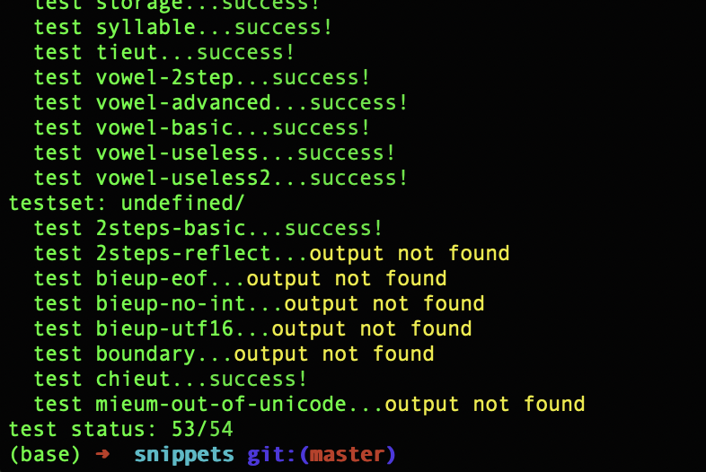

# 아희짓

## Brief English introduction

AheuiJIT is a just in time compiler for [Aheui language](https://aheui.readthedocs.io/en/latest/specs.en.html) built from scratch. Its design is inspired by LLVM and dynarmic project.

## 개요

아희짓은 [아희 언어](https://aheui.readthedocs.io/en/latest/introduction.html)를 위한 JIT (Just in Time) 컴파일러입니다. 어셈블러와 유틸 라이브러리외에 외부 라이브러리에 전혀 의존하지 않고 JIT을 바닥부터 구현합니다. 

## 지원 사양

현재 64비트 x86 운영체제 만 지원합니다. 제작자가 시간이 생긴다면 ARM도 지원할 예정입니다.

## 사용법

릴리즈 페이즈에 가서 운영체제에 맞는 압축파일을 다운받고 압축을 푸세요.
```
bin/AheuiJITCli 아희파일 
```
로 아희 프로그램을 실행해볼 수 있습니다.

inlcude와 lib폴더에는 정적 라이브러리로 빌드된 AheuiJIT이 있습니다.

## 구현 완성도



[아희 테스트 케이스](https://github.com/aheui/snippets) 중 64 비트 정수 출력을 제외한 모든 테스트를 통과합니다.

## 성능

logo 아희 테스트를 0.29초 안에 완료합니다. 이는 [기존 비교표](http://xnuk.github.io/Comparison-of-aheui-implementations/) 기준 Algy/aheui-cc (0.11초)를 제외한 모든 구현체보다 월등히 빠른 속도입니다.

```
/usr/bin/time AheuiJITCli logo.aheui > out.out
0.29 real         0.29 user         0.00 sys
```

## 빌드 

C++17을 지원하는 컴파일러와 cmake을 깔고 아래 명령어를 실행하면 됩니다.

```
git submodul update --init
mkdir build
cd build
cmake ..
```

## TODOs

현재 기본적인 최적화만 구현된 상태입니다. 이정도로도 엄청나게 빠르지만 더 빨라질 여지가 많습니다.

### pop optimization

연산자가 저장소의 모든 원소를 다 사용한 경우 반대 방향으로 이동해야하는 아희 명세를 구현하기 위해 저장소 pop 연산이 약간 비효율적으로 구현되어있습니다. 저장소 끝자락 페이지의 읽기 권한을 없애고 예외 헨들러를 달아서 저장소 잔여 공간 체크 루틴을 없애버릴 수 있습니다. GPU 드라이버가 텍스쳐 캐시를 구현할 때 자주 쓰는 기법입니다. 저장소 소진이 매우 자주 일어난다면 더 느리겠지만 이 경우 기존 체크 루틴을 사용하게 다시 컴파일 하는 식으로 대응할 수 있습니다.

### instruction scheduling

logo 테스트 같이 커다란 아희 프로그램에서 연산자를 좀더 잘 나열하면 메모리를 선형으로 참조 & 갱신하게 만들 수 있을 것 같습니다. 이러면 vectorization을 할 여지도 생깁니다.

### inline basic block

push와 pop을 매칭하는 peephole 최적화는 굉장히 효과적입니다. 이 최적화를 끄고 logo 테스트 케이스를 돌리면 15초씩이나 걸립니다. 이 최적화는 특성상 basic block 크기가 클수록 더 효과가 커지는데 여러 basic block을 합치는 식으로 효과를 더 증대할 수 있습니다. 